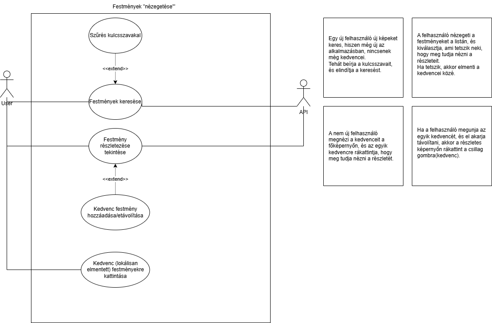
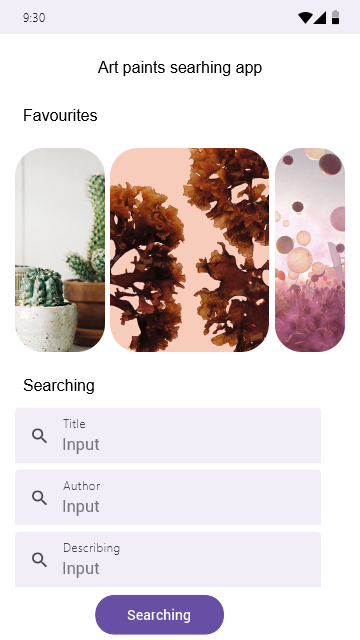
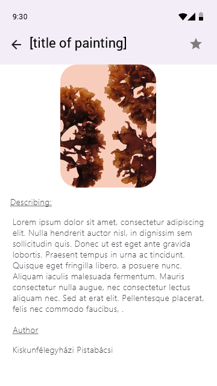
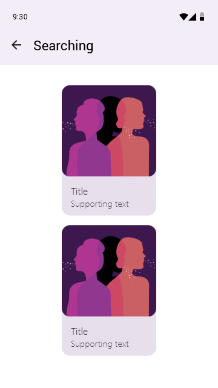
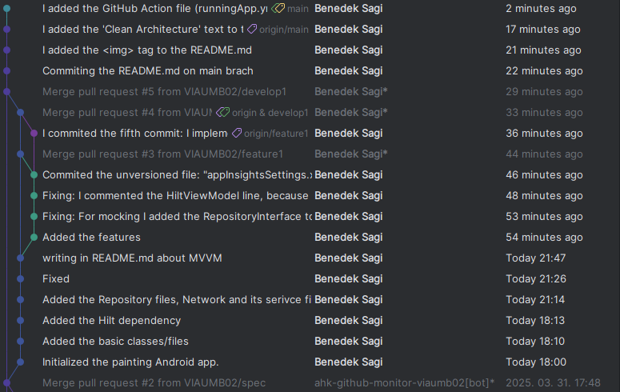
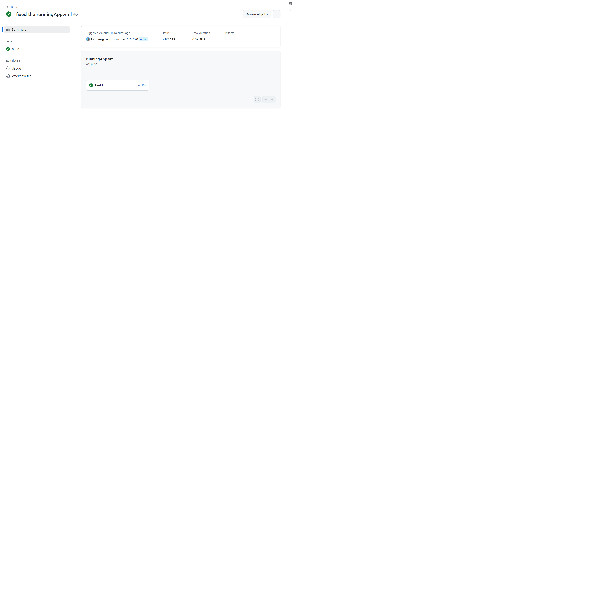
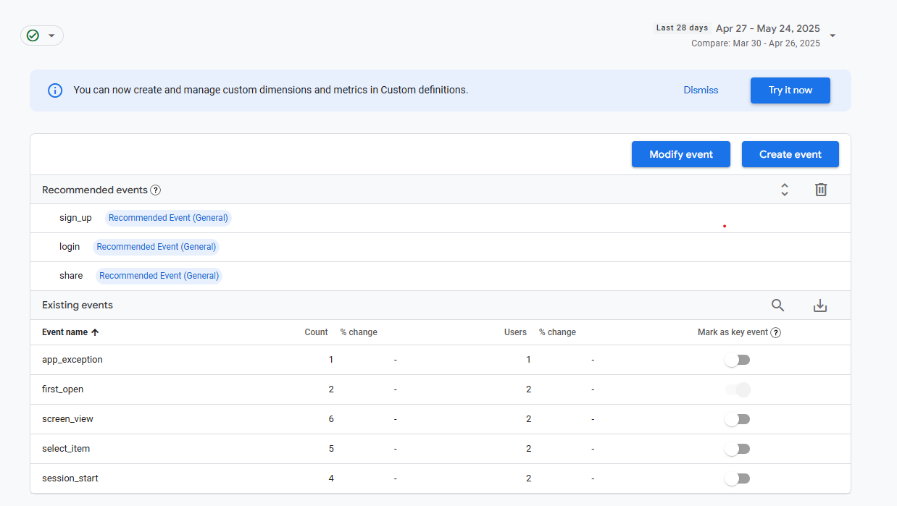
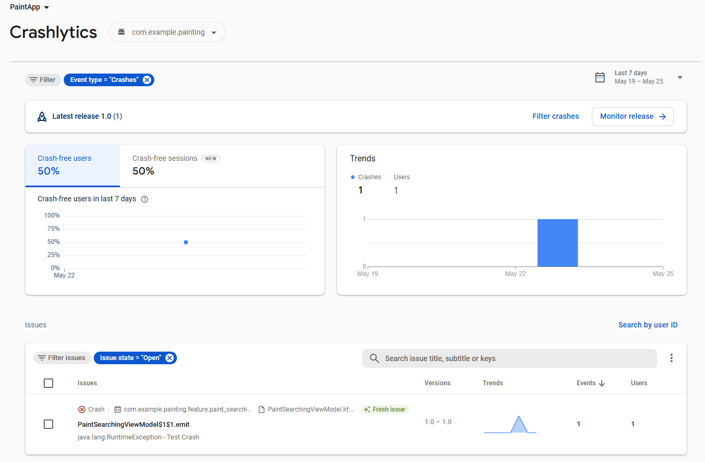
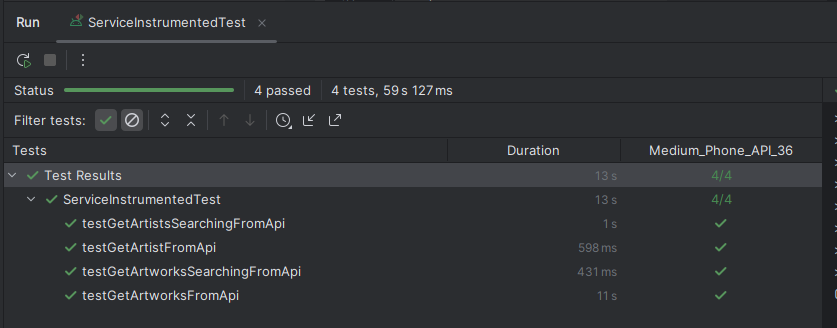
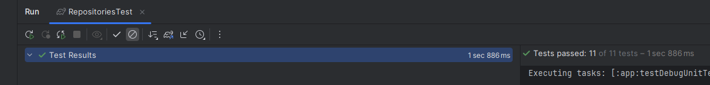

## Mobilszoftver Laboratórium
### 2025 tavaszi félév
### Sági Benedek - (ECSGGY)
### Laborvezető: Sík Dávid

## Painting app

# Presentation (Lab 1)

Fans of the **Art Institute of Chicago** have their favorite paintings, but they would like to discover, search for, and save more artworks to remember and view them in person at the institute.  
The application exclusively features paintings from the Art Institute of Chicago.

## Main Features

### 1. Search for Paintings
- **A. By Title**  
- **B. By Artist Name**  
- **C. By Keywords** (e.g., if you're searching for paintings with cats, you can enter "cat" as a keyword)  

Filling in these fields is optional:  
If left empty, the app will perform a search using randomly selected locally saved keywords.

After the search, paintings are listed (without detailed view).

### 2. View Painting Details
- Painting details include: **Title, Author, Description**, and an option to **save as a Favorite** locally.  
- Only paintings can be saved or removed from favorites.
- (Listing of authors is omitted for simplicity, but can be added later if needed.)

## Use Case and User Story ("Browsing Paintings")

## Screen Designs

1.   
2.   
3. 

---

# Architecture: MVVM (Lab 2)

The **Model-View-ViewModel** architecture separates the view, business logic, and data layers into a layered and modular structure.  
It is largely based on **Clean Architecture**, featuring modules for **Dependency Injection (DI)** and **data sources**.

### View Layer
- `Navigation`
- `ui` and its subfolders

### Business Logic
- `feature` and its subfolders

### Data Layer
- `data`: Contains `Dao`, `DataSource`, `di` (Hilt), and `entities`
- `network`

> I chose this architecture because it's currently the most robust solution for a well-structured application.  
> Also, in Jetpack Compose development, the ViewModel approach simplifies building and managing UI.

---

## Commit Overview

## GitHub Actions

---

# Service (API) and ORM with Room (Lab 3)

## Service Classes

### Models (Purpose: Describes entities and maps selected JSON fields)
- **`ArtistApi`**: Represents attributes of an artist
- **`ArtworkApi`**: Represents attributes of an artwork
- **`Pagination`**: Describes API pagination info (total items, current page, total pages, next URL)
- **`ApiResponse`**: Wraps API response structure: `pagination: {}, data: [{}, {}, {}]`

### API Interfaces (Purpose: Fetch data from the API using paths/queries)
- **`ArtistService`**: Fetches artist-related data
- **`ArtworkService`**: Fetches artwork-related data
- **`ImageService`**: Fetches image data for artworks

---

## ORM Classes

### Entities (Purpose: Define local database entities)
- **`Artist`**: Same attributes as `ArtistApi`, ORM-compatible
- **`Artwork`**: Same attributes as `ArtworkApi`, ORM-compatible
- **`ImageEntity`**: Separated from `Artwork` for easier long-term maintainability

### DAO (Purpose: Define database operations like insert, delete, query)
- **`ArtistDao`**: Handles artist database operations
- **`ArtworkDao`**: Handles artwork database operations (e.g., save, get favorites)
- **`ImageDao`**: Handles image database operations for artworks

---

## Repositories (Purpose: Connect DAO and Service layers)

- **`ArtistRepository`**: Interface for artist-related operations
- **`ArtistRepositoryImpl`**: Implements the interface using `ArtistService` and `ArtistDao`
- **`ArtworkRepository`**: Interface for artwork-related operations
- **`ArtworkRepositoryImpl`**: Implements the interface using `ArtworkService` and `ArtworkDao`
- **`ImageRepository`**: Interface for image operations
- **`ImageRepositoryImpl`**: Implements image handling using `ImageService` and `ImageDao`

---

## Dependency Injection (DI)

- **`NetworkModule`**: Provides dependencies like Retrofit, `ArtistService`, `ArtworkService`, `ImageService`
- **`PersistenceModule`**: Provides Room database, DAOs (`ArtistDao`, `ArtworkDao`, `ImageDao`) for Hilt

---

# Firebase Integration

### Events

### Crashlytics

---

# Test Units (Strategy)

### Local Unit Tests (Without Android Context)

- **Goal**: Test behavior of `ArtworkRepository`, `ArtistRepository`, `ImageRepository` without Android dependencies
- **Tech**: JUnit4, MockK, kotlinx.coroutines.test
- **Mocks**: API (Service) and DAO
- **Focus**:
  - Handling API responses
  - Database operations (insert, delete, query)
  - Keyword search logic
- **Benefit**: Fast, isolated, no emulator/device required

### Instrumentation Tests (With Android Context)

- **Goal**: Validate integration in actual Android environment
- **Tech**: AndroidJUnit4, Room, Retrofit, Gson
- **Focus**:
  - Real API calls (`ArtworkService`, `ArtistService`)
  - Room database integration
- **Benefit**: Ensures correct behavior within the Android system

---

## Test Coverage

### Local Unit Tests (12 tests)
- **ArtworkRepository**: 7 tests (queries, save, delete, search)
- **ArtistRepository**: 5 tests (queries, save, delete)

### Instrumentation Tests (8 tests)
- **Service Tests (4)**:
  - Fetching artworks and artists
  - Keyword-based API searches
- **Database Tests (4)**:
  - Insert and delete for artworks and artists
  - Querying lists using Flow

### Successful Test Runs

